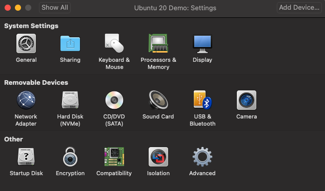

This repo contains two packages that are used to simulate a custom robot arm desgin for on-orbit assembly and manufacturing tasks.


## Workstation Specs and Dependencies
* Ubuntu 20.04: 
* VMware Install ([VMware Workstation Player 17](https://www.vmware.com/products/workstation-player.html) for Windows | [VMWare Fusion Player](https://customerconnect.vmware.com/en/downloads/info/slug/desktop_end_user_computing/vmware_fusion/13_0)
13 for macOS)
* ROS1 Noetic: 
* Moveit1 for Noetic: [install from source](https://ros-planning.github.io/moveit_tutorials/doc/getting_started/getting_started.html)
* Knowledge of basic moveit is recommended for successfully navigating this repo. If unfamiliar with Moveit, I recommend goining through the beginning tutorials offered [online](https://github.com/BillyMazotti/OSAM-ARM-Moveit).


## Installation Steps
Install ROS1 Noetic following the instructions [here](https://wiki.ros.org/noetic/Installation/Ubuntu).

Install Moveit for ROS1 Noeticusing the steps outlined [here](https://ros-planning.github.io/moveit_tutorials/doc/getting_started/getting_started.html) or in INSTALL_MOVEIT_4_NOETIC.rst.


Add the teleop_twist_keyboard and OSAM_ARM_Moveit repo to the catkin workspace
```
cd ~/ws_moveit/src
git clone https://github.com/BillyMazotti/OSAM-ARM-Moveit
git clone https://github.com/ros-teleop/teleop_twist_keyboard.git
catkin build teleop_twist_keyboard osam_arm_4_urdf_v2 moveit_osam_arm_sim_v2 --no-deps
```

Lastly follow the setup steps (everything before launch the gazebo simulation) [here](https://ros-planning.github.io/moveit_tutorials/doc/realtime_servo/realtime_servo_tutorial.html) or in realtime_servo_tutorial.rst.

## Launching the Arm Simulation
In a new terminal run the following commands to launch Gazebo and RViz.
```
cd ~/ws_moveit
source devel/setup.bash
roslaunch moveit_osam_arm_sim_v2 full_robot_arm_sim.launch
```

You will see an empty environment. 


Zooming out will reveal the osam arm. The arm is placed 6 meters above the ground so as to not collide with the ground defined by Gazebo in any possible joint configuration.


Centering and zooming in on the robot arm, we can better visualize the arm.


In RViz, change the planning group from "endeffector" to "manipulator"


The majority of the manipulator's links will be covered in orange.


Grab the red/blue/green "interactive marker" and drag the robot's endeffector to a non-singular position (not all the zero joint angles) that is not close to a joint limit. This prevents the robot arm from immediately reaching a singularity when starting to use the velocity controller.


Click "plan and execute" to move the robot to that pose. The white model of the robot arm should move towrads the the orange model of the arm.


We are now ready to start the velocity controller. In a new terminal check to see which controllers are active by running the following in a new terminal
```
rosservice call /controller_manager/list_controllers
```

You should see that the "joint_group_posiiton_controller" (i.e. the velocity controller for the arm) is initialized and the "arm_controller" is running (i.e. the position controller for the arm). The "hand_ee_controller" controls the gripper and the "joint_state_controller" is responsible for publishing the joint states of the arm.


To change the from position control of the arm to velocity control, we can run the following
```
python3 src/OSAM-ARM-Moveit/scripts/change_controller.py "velocity"
```

By re-running `rosservice call /controller_manager/list_controllers` we can verify that the "joint_group_position_controller" velocity controller is now running and the "arm_controller" position controller is stopped.


To verify the velocity controller works, we can teleoperate the robot arm by running the following in a new terminal:
```
cd ~/ws_moveit
source devel/setup.bash
rosrun teleop_twist_keyboard teleop_twist_keyboard.py cmd_vel:=/servo_server/delta_twist_cmds _stamped:=True _speed:=0.05 _repeat_rate:=100.0
```

Using the commands suggested by the readout, you should be able to controll the robot in 4 degrees of freedom (+/-x, +/-y, +/-z, +/-roll). You should also be able to adjust the speed of movement.


## Enable File Sharing
Since this project was made to work for running Ubuntu on VMware, we need to enable file sharing between the host machine and virtual machine. If a future version of this project is running everything on the host machine please skip this step.

First enable file sharing on your virtual machine. Open your virtual envionment's settings by clicking on the wrench icon located in the upper left


You should see the following screen pop up:


Click on sharing and check "Enable Shared Folders"


In your virtual machine, go to files and click on Other locations, you should see a network for Remote Login.


If you do not see this network available, you will need to enable remote login on your host computer. For macs, this setting can be found at System Settings > General > Sharing > Remote Login and ensure you toggle it on.

If successful, you should be able to view all files on your host computer:


## Define Paths to JSON comms files
For recieving and sending commands from and to the twin simulation in Unreal Engine 5, we need to define the paths to the files, joints_positions.json and ee_velocity.json respectively, found in the OSAM-Project repo on the host computer. Using files, find where the OSAM-Project repo is on your computer, right click in files and click on "Open in Local Terminal". By typing pwd into the terminal that just popped up, you we now have the file path for both json files.


## Download OSAM-Project.zip and watch the YouTube for following the remaining steps
* [OSAM-Project.zip](https://drive.google.com/file/d/1Y-wGNutQ8dwV8XDoismog4yee_TjyPtF/view?usp=sharing)
* OSAM Project Final Setup YouTube video: https://www.youtube.com/watch?v=7pNdTCxkBLM

